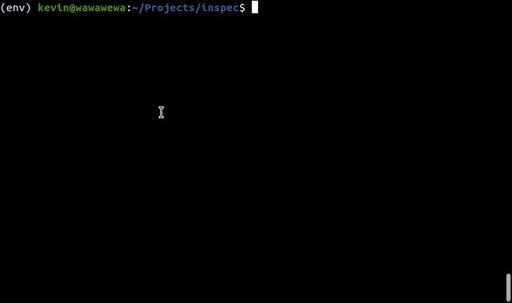
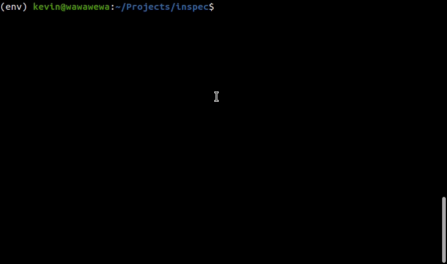

# inspec
View spectrograms of audio data files in the terminal as unicode characters. Provides printing to stdout, a terminal gui built on curses, and importable functions. I made this so it would be easier to inspect audio files over ssh.



## Install

```
pip install inspec
```

## Usage

### Command Line

Launch the GUI viewer, inferring type of file based on extension and contents
```shell
inspec open FILENAME [-r ROWS] [-c COLS] [--cmap CMAP]
```

Print a file to stdout, inferring type of file base on extension and contents
```shell
inspec show FILENAME [-w WIDTH] [-h HEIGHT] [--cmap CMAP] [--horizontal OR --vertical]
```




### Python

Convenience methods mirroring the cli
```python
import inspec

# Open a terminal gui (like inspec open)
inspec.open_gui(FILENAMES, rows=2, cols=2, cmap="viridis")
# Printing to stdout (like inspec show)
inspec.show(FILENAME, width=0.5, height=0.5)
```

For more fine-grained control, or to extend the visualizations to other data formats, you can add/modify/remove intermediate processing steps. These are

1. reading in data (`inspec.io`)

2. converting to 2D image array (`inspec.transform`)

3. converting image data into 2d array of unicode characters and foreground/background scale values between 0 and 1 (`inspec.maps`)

4. applying a colormap to the colors, converting into a 2d array of unicode characters and foreground/background color values (`StdoutRenderer.apply_colormap_to_char_array()`)

3. and then displaying those characters. (`StdoutRenderer.render()`)

```python
import inspec
from inspec.colormap import load_cmap
from inspec.io import AudioReader
from inspec.maps import QuarterCharMap
from inspec.render import StdoutRenderer
from inspec.transform import SpectrogramTransform

cmap = load_cmap("viridis")
transform = SpectrogramTransform(1000, 50, min_freq=250, max_freq=10000)

data, sampling_rate, _ = AudioReader.read_file("sample.wav")
img, _ = transform.convert(data, sampling_rate, output_size=(80, 160))
char_img = QuarterCharMap.to_char_array(img)
char_img_colorized = StdoutRenderer.apply_cmap_to_char_array(cmap, char_img)

StdoutRenderer.display(char_img_colorized)
```

#### GUI

The main GUI is built on **asyncio** and **curses**, though visualizations can be printed directly as well. The base class is in `inspec.gui.base`

```python
import curses
from inspec.gui.base import InspecCursesApp

def _run(stdscr):
    app = InspecCursesApp(refresh_rate=40, debug=True)
    asyncio.run(app.main(stdscr))

curses.wrapper(_run)
```

The main methods that should be implemented in an app derived from `InspecCursesApp` are `refresh()`, `initialize_display()`, and `handle_key(ch)`. See examples in `inspec/develop/example_apps.py`.


## Development

```
git clone git@github.com:kevinyu/inspec.git
cd inspec
python -m venv env
source bin/activate
pip install -r requirements.txt
```

Run unittests
```
inspec dev unittests
```

## Compatibility

Definitely works on Ubuntu + Python3.8. Kind of works on Windows 10 + Python3.8 in Powershell but a little unstable, needs `pip install windows-curses` as well.

## Todo

* Create a module for live streaming data?
* Simpler API to view data from data structures instead of reading from disk
* Image viewing
* Debouncing key inputs in gui (throttle holding arrow keys, scroll wheel, etc)
* Cleaning up parameters for functions in inspec/inspec.py and their corresponding cli commands in inspec/cli.py
* Better documentation
